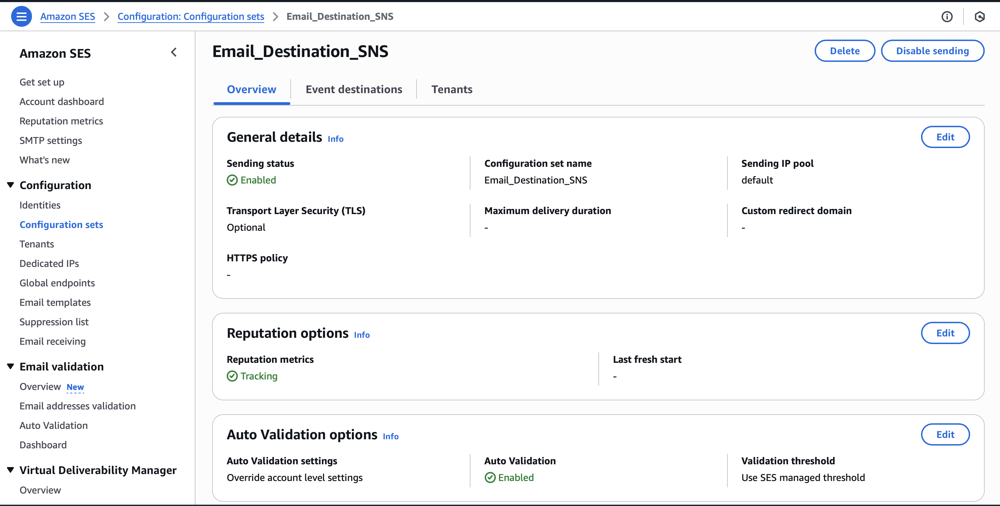

<!-- # Radha -->

# [Email Event Processing System](<[https://travel-saathi.netlify.app/](https://food-app-client-three.vercel.app)>)

## 📌 Introduction

[](https://awesome.re)

This project implements a scalable and fault-tolerant email event processing architecture using AWS services.

## Architecture

```
SES
 │
 ▼
SNS (email events)
 │
 ▼
SQS (buffer + DLQ)
 │
 ▼
Worker / Cron (batch processing)
 │
 ▼
Redis (deduplication)
 │
 ▼
Webhook
 │
 ▼
Database (analytics / state)

```

## 👨‍💻 Tech Stack Used

### Frontend

- ReactJS, TailwindCSS, Material UI, JavaScript, Axios

### Backend

- Node.js, Express.js, JWT, MongoDB, BullMQ, Redis, AWS SES, SNS, SQS, WebHook

## 🛠️ Installation Steps

## 📸 Screenshots



